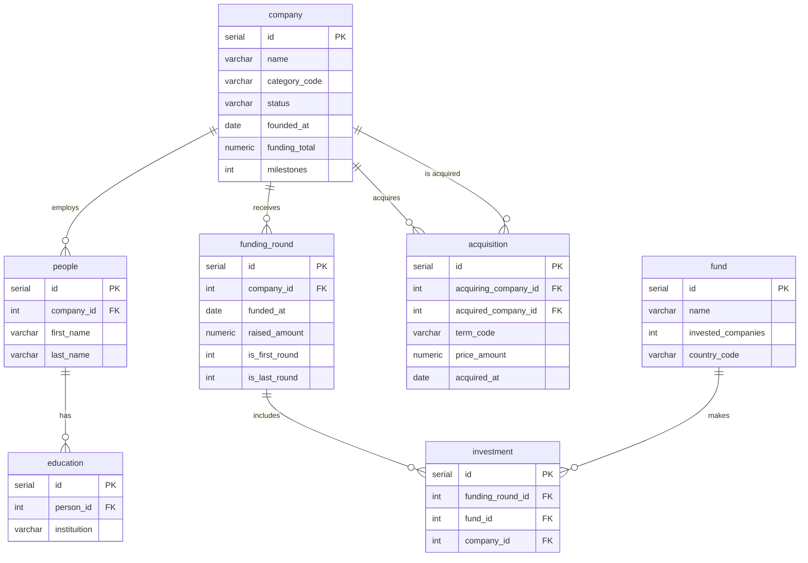

# SQL — Анализ стартап-экосистемы

Практический проект по работе с реляционной базой данных в предметной области венчурных инвестиций и стартапов.

## О проекте

База данных моделирует экосистему технологических компаний: раунды финансирования, инвестиции венчурных фондов, сделки поглощения (M&A), сотрудников и их образование.

**Файлы:**

| Файл | Описание |
|------|----------|
| [table_from_task.sql](./table_from_task.sql) | DDL — создание 7 связанных таблиц |
| [sql_tasks.sql](./sql_tasks.sql) | 23 аналитических SQL-запроса |
| [sql_project.pdf](./sql_project.pdf) | Справочник: основные принципы SQL |

---

## Схема базы данных



---

## Таблицы

| Таблица | Содержание |
|---------|------------|
| **company** | Компании-стартапы: статус, категория, страна, объём финансирования |
| **people** | Сотрудники компаний |
| **education** | Образование сотрудников |
| **fund** | Венчурные фонды и их активность |
| **funding_round** | Раунды инвестиций |
| **investment** | Связь фондов с раундами и компаниями |
| **acquisition** | Сделки поглощения (cash / stock / cash_and_stock) |

---

## Задачи и навыки

В [sql_tasks.sql](./sql_tasks.sql) — 23 запроса, сгруппированных по темам:

### Базовые запросы (задачи 1–6)
- Фильтрация (`WHERE`, `LIKE`), сортировка, агрегация (`COUNT`, `SUM`, `GROUP BY`, `HAVING`)

### Условная логика и аналитика (задачи 7–10)
- `CASE WHEN` для сегментации (активность фондов)
- Подзапросы в `FROM`, фильтрация по диапазону дат (`EXTRACT`)

### JOIN-ы (задачи 11–18)
- `LEFT JOIN`, `INNER JOIN`, `RIGHT JOIN`
- Связь компаний, сотрудников и образования
- Подзапросы в `WHERE` и `IN`

### Сложная аналитика (задачи 19–23)
- Многоуровневые JOIN-ы и подзапросы
- CTE (`WITH`) для помесячной аналитики инвестиций и M&A
- Сравнение метрик по странам за несколько лет

---

## Как запустить

1. Создайте базу PostgreSQL и выполните [table_from_task.sql](./table_from_task.sql).
2. Загрузите тестовые данные (если есть) или используйте свою выборку.
3. Выполняйте запросы из [sql_tasks.sql](./sql_tasks.sql) по одному (разделитель `---`).

```bash
psql -U postgres -d startup_db -f table_from_task.sql
psql -U postgres -d startup_db -f sql_tasks.sql
```

---

## Примеры запросов

**Топ-5 компаний по числу уникальных вузов сотрудников:**

```sql
SELECT c.name, COUNT(DISTINCT tab2.instituition)
FROM company AS c
LEFT JOIN (
    SELECT tab1.instituition, p.company_id
    FROM (
        SELECT person_id, instituition
        FROM education
        WHERE instituition IS NOT NULL
    ) AS tab1
    INNER JOIN people AS p ON p.id = tab1.person_id
) AS tab2 ON tab2.company_id = c.id
GROUP BY c.name
ORDER BY COUNT(DISTINCT tab2.instituition) DESC
LIMIT 5;
```

**CTE: помесячная статистика инвестиций США и сделок M&A (2010–2013):**

См. задачу 22 в [sql_tasks.sql](./sql_tasks.sql) — используются 4 CTE и `LEFT JOIN` для объединения метрик.
